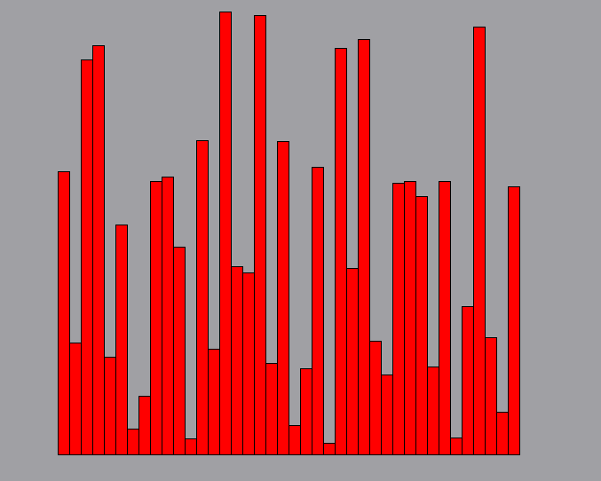
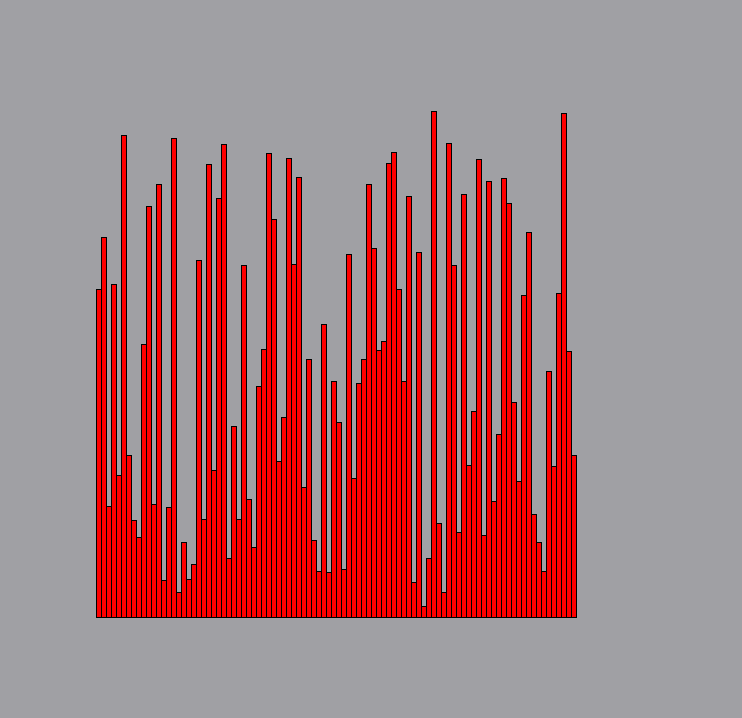

# SortingVisualizer
An app built with Qt to visualize a few implemented sorting algorithms.

You can use this app to understand how some sorting algorithms work. I will add more algorithms soon.

You can change the speed of the visualization and try to understand better the algorithm in slow motion.

You can change the number of blocks to be sorted and even the dimension of them.

You can reset the board to make it unsorted again.

I added data validation soo you can't start the algorithms or refresh the board if it is an algorithm in progress.

## Bubble Sort:

## Insertion Sort:

## Merge Sort:

## Quick Sort:

## Radix Sort:

## Refresh:

